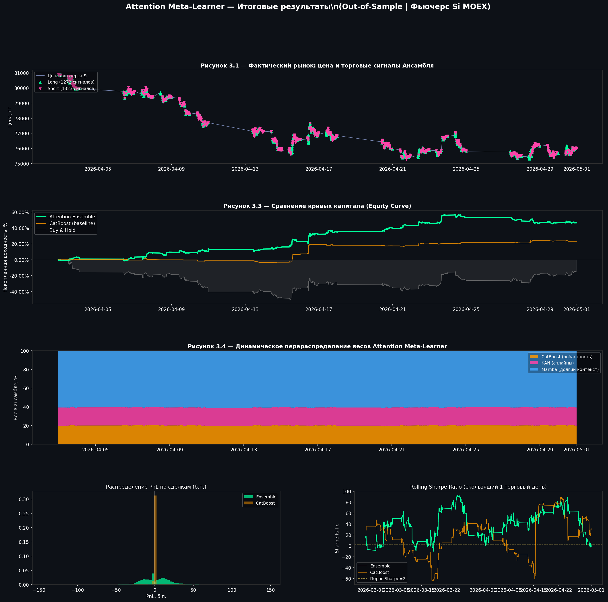
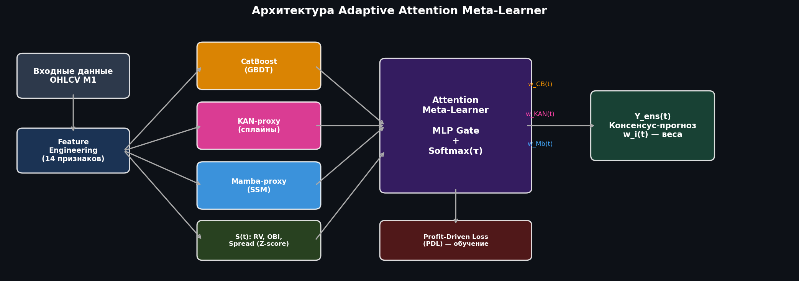
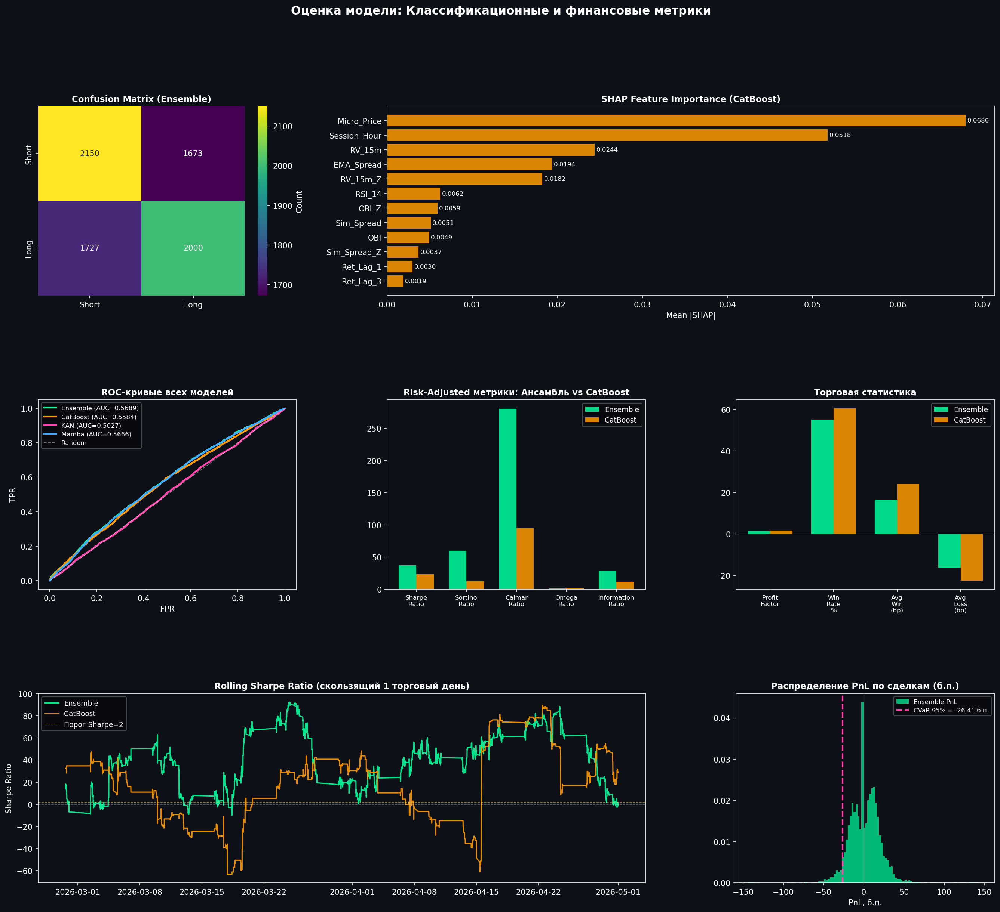

# Attention Meta-Learner for MOEX Si Futures

**Выпускная квалификационная работа Николая Букина о коллективных методах интеллектуальной обработки биржевых данных.**

> Исследование перспектив развития коллективных методов интеллектуальной обработки больших объёмов биржевых данных с целью улучшения качества краткосрочных прогнозов изменения цен.

[Диплом (PDF)](docs/thesis.pdf) · [Презентация (PDF)](docs/presentation.pdf) · [Исследовательский ноутбук](notebooks/attention_meta_learner.ipynb) · [Интерактивный дашборд](app.py)

## О проекте

Проект исследует адаптивный ансамбль для краткосрочного прогнозирования направления цены фьючерса Si (USD/RUB) на Московской бирже. Вместо фиксированного усреднения базовых моделей Attention Meta-Learner динамически распределяет веса между разнородными предикторами в зависимости от состояния рынка.

Репозиторий объединяет теоретическую часть ВКР, полный вычислительный эксперимент, данные, результаты бэктеста и Streamlit-приложение для интерактивного анализа.

## Как устроен эксперимент

1. Загружаются минутные OHLCV-данные фьючерса Si.
2. Формируются 29 признаков: доходности, волатильность, импульс, объём и proxy-признаки рыночной микроструктуры.
3. Целевая переменная размечается методом Triple-Barrier с горизонтом 10 минут.
4. Обучаются CatBoost, LightGBM, KAN-proxy и Mamba-proxy.
5. Attention Meta-Learner вычисляет динамические веса CatBoost, KAN и Mamba.
6. Profit-Driven Loss учитывает направление сделки и упрощённые транзакционные издержки.
7. Качество проверяется временным holdout-разбиением, purged cross-validation и векторизованным бэктестом.

## Ключевые результаты

Показатели ниже рассчитаны из [data/backtest_results.csv](data/backtest_results.csv) для holdout-периода с 19 февраля по 30 апреля 2026 года (7 550 минутных наблюдений).

| Метрика | Attention Ensemble | CatBoost | Buy & Hold |
|---|---:|---:|---:|
| Накопленная доходность | **118,40%** | 31,15% | −8,87% |
| Annualized Sharpe | **37,02** | 23,38 | — |
| Максимальная просадка | −11,84% | **−9,19%** | — |

Это результат исследовательского бэктеста при допущениях ноутбука, а не подтверждённая доходность реальной торговой системы.

## Состав репозитория

~~~text
attention-meta-learner-moex/
├── app.py                         # интерактивный Streamlit-дашборд
├── assets/                        # архитектура, EDA и итоговые графики
├── data/
│   ├── Si_1min_2025-05-02_2026-04-30.csv
│   └── backtest_results.csv
├── docs/
│   ├── thesis.pdf                 # полный текст ВКР
│   └── presentation.pdf           # презентация к защите
├── notebooks/
│   └── attention_meta_learner.ipynb
├── tests/
│   └── test_data.py
├── requirements.txt               # зависимости дашборда
└── requirements-research.txt      # зависимости полного эксперимента
~~~

## Быстрый запуск дашборда

~~~bash
git clone https://github.com/Boo4kin/attention-meta-learner-moex.git
cd attention-meta-learner-moex

python -m venv .venv
# Windows:
.venv\Scripts\activate
# macOS / Linux:
# source .venv/bin/activate

python -m pip install -r requirements.txt
streamlit run app.py
~~~

После запуска Streamlit покажет локальный адрес, обычно http://localhost:8501.

## Полное воспроизведение исследования

Полный эксперимент существенно тяжелее дашборда: он обучает несколько моделей и может использовать GPU.

~~~bash
python -m pip install -r requirements-research.txt
jupyter lab notebooks/attention_meta_learner.ipynb
~~~

Открывайте Jupyter из корня репозитория. Пути в ноутбуке настроены на каталоги data и assets.

## Данные

- **Исходная выборка:** 219 529 минутных баров Si с 2 мая 2025 года по 30 апреля 2026 года.
- **Поля:** ticker, period, date, time, OHLC, volume и open interest.
- **Результаты:** 7 550 строк holdout-бэктеста с сигналами, PnL, кривыми капитала и динамическими весами ансамбля.
- Исходный файл использует разделитель «точка с запятой».

## Ограничения

- Проект создан в исследовательских и образовательных целях и не является инвестиционной рекомендацией.
- Order Book Imbalance, spread и micro-price аппроксимируются из OHLCV, а не рассчитываются по реальному стакану заявок.
- Бэктест использует упрощённую модель комиссий и не моделирует в полном объёме проскальзывание, задержки и ликвидность.
- Результаты исторического тестирования не гарантируют будущую доходность.
- Отдельная лицензия на повторное использование материалов пока не указана.

